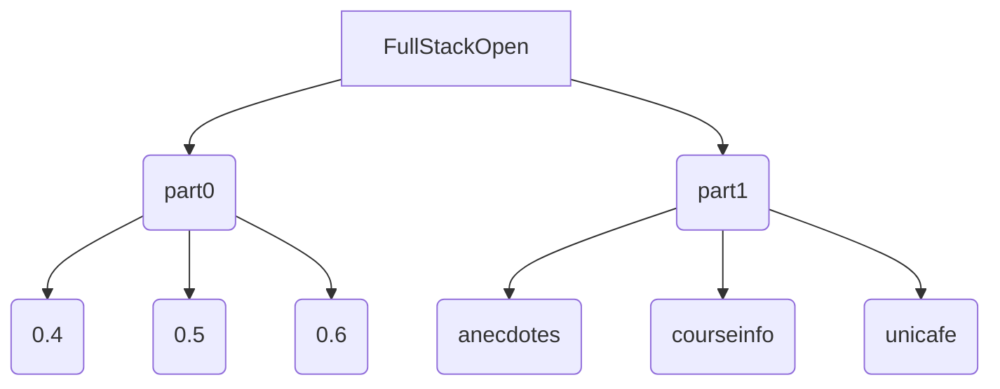

# fso

FullStackOpen Repo

```mermaid
    flowchart TB
        A[FullStackOpen] --> B(part0)
        B --> C(0.4)
        B --> D(0.5)
        B --> E(0.6)

        A --> F(part1)
        F --> G(anecdotes)
        F --> H(courseinfo)
        F --> I(unicafe)
```
